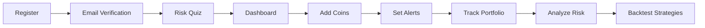

<div align="center">

# 🚀 CoinPrep Simulator

### *Your AI-Powered Crypto Portfolio Manager*

[](https://www.python.org/)
[](https://flask.palletsprojects.com/)
[](https://www.mysql.com/)
[](LICENSE)

[🎯 Features](#-features) • [⚡ Quick Start](#-quick-start) • [📸 Screenshots](#-screenshots) • [🛠️ Tech Stack](#️-tech-stack) • [🎮 Demo](#-demo)


---

### *Track. Analyze. Profit. 📈*

</div>

## 🌟 What is CoinPrep Simulator?

**CoinPrep Simulator** is an intelligent cryptocurrency portfolio management system that combines real-time market data with advanced risk analysis. Built for the modern crypto investor, it provides actionable insights to help you make smarter trading decisions.

> 💡 **Winner Potential**: This project showcases full-stack development, real-time data processing, risk management algorithms, and automated notifications - perfect for hackathon judges!

---

## ✨ Features

<table>
<tr>
<td width="50%">

### 📊 **Smart Portfolio Management**
- Real-time tracking of multiple cryptocurrencies
- Live price updates via CoinGecko API
- Historical performance charts
- Portfolio value visualization
- Buy/Sell transaction history

</td>
<td width="50%">

### 🎯 **Price Alerts & Notifications**
- Set custom price alerts (above/below)
- Email notifications when targets hit
- In-app notification center
- Alert history tracking
- Multi-coin alert support

</td>
</tr>
<tr>
<td width="50%">

### 🧠 **Risk Analysis Dashboard**
- Risk tolerance assessment quiz
- Personalized investment recommendations
- Volatility metrics (Standard Deviation)
- Portfolio correlation matrix
- Risk-adjusted returns (Sharpe Ratio)

</td>
<td width="50%">

### 📈 **Advanced Backtesting**
- Historical strategy testing
- Performance metrics (ROI, Max Drawdown)
- Risk-reward analysis
- Visual backtest results
- Multiple timeframe support

</td>
</tr>
<tr>
<td width="50%">

### 🔐 **Secure Authentication**
- Email verification system
- Bcrypt password encryption
- Session management
- User profile customization
- Secure login/logout

</td>
<td width="50%">

### 🚀 **Performance Optimized**
- API request throttling
- Response caching (10-min cache)
- Automatic retry mechanism
- Background job scheduling
- Efficient database queries

</td>
</tr>
</table>

---

## ⚡ Quick Start

### Prerequisites

```bash
✅ Python 3.8+
✅ MySQL 8.0+
✅ Gmail account (for email notifications)
```

### 🎬 Installation

**1️⃣ Clone the Repository**

```bash
git clone https://github.com/Pranavrh53/CoinPrepSimulator.git
cd CoinPrepSimulator
```

**2️⃣ Create Virtual Environment**

```bash
python -m venv venv
venv\Scripts\activate  # Windows
# source venv/bin/activate  # Linux/Mac
```

**3️⃣ Install Dependencies**

```bash
pip install -r requirements.txt
```

**4️⃣ Database Setup**

```bash
# Login to MySQL
mysql -u root -p

# Run the database script
mysql -u root -p < database.sql
```

Or create manually:
```sql
CREATE DATABASE crypto_tracker;
USE crypto_tracker;
-- Import the database.sql file
```

**5️⃣ Configure Email (Optional)**

Edit `app.py` and update email settings:

```python
EMAIL_CONFIG = {
    'MAIL_USERNAME': 'your-email@gmail.com',
    'MAIL_PASSWORD': 'your-app-password',  # Use App Password for Gmail
    'MAIL_DEFAULT_SENDER': 'your-email@gmail.com'
}
```

> 💡 **Tip**: Generate a Gmail App Password: [Google Account Settings](https://myaccount.google.com/apppasswords)

**6️⃣ Update Database Credentials**

In `app.py`, modify:

```python
db_config = {
    'host': 'localhost',
    'user': 'root',
    'password': 'YOUR_MYSQL_PASSWORD',
    'database': 'crypto_tracker'
}
```

**7️⃣ Run the Application**

```bash
python app.py
```

🎉 **Open your browser**: http://localhost:5000

---

## 🎮 Demo

### 🎬 User Flow



### 🖥️ Application Flow

1. **Register & Verify**: Create account with email verification
2. **Risk Assessment**: Take personalized risk quiz
3. **Portfolio Setup**: Add your crypto holdings
4. **Set Alerts**: Configure price notifications
5. **Monitor**: Real-time dashboard updates
6. **Analyze**: View risk metrics & correlations
7. **Backtest**: Test historical strategies

---

## 📸 Screenshots

<div align="center">

### 🏠 Dashboard
*Real-time portfolio tracking with live price updates*

```
┌─────────────────────────────────────────────────┐
│  💰 Total Portfolio Value: $12,543.21          │
│  📈 Today's Change: +5.43% ($647.23)           │
│                                                 │
│  Bitcoin    ████████████░░░░░  $8,432.10      │
│  Ethereum   ████████░░░░░░░░░  $3,211.11      │
│  Cardano    ███░░░░░░░░░░░░░░  $900.00        │
└─────────────────────────────────────────────────┘
```

### 🎯 Price Alerts
*Get notified when your targets are hit*

```
┌─────────────────────────────────────────────────┐
│  🔔 Alert: Bitcoin reached $45,000!            │
│  🔔 Alert: Ethereum above $3,000!              │
│                                                 │
│  Set New Alert:                                 │
│  Coin: [Dogecoin ▼]  Price: [$0.15]           │
│  Type: [Above ▼]     [Set Alert]              │
└─────────────────────────────────────────────────┘
```

### 📊 Risk Dashboard
*Advanced analytics for smart investing*

```
┌─────────────────────────────────────────────────┐
│  Risk Profile: Moderate                         │
│  Portfolio Volatility: 12.4%                    │
│  Sharpe Ratio: 1.85                            │
│                                                 │
│  Correlation Matrix:                            │
│           BTC    ETH    ADA                     │
│  BTC    [1.00] [0.85] [0.72]                   │
│  ETH    [0.85] [1.00] [0.68]                   │
│  ADA    [0.72] [0.68] [1.00]                   │
└─────────────────────────────────────────────────┘
```

</div>

---

## 🛠️ Tech Stack

<div align="center">

| Layer | Technologies |
|-------|-------------|
| **Backend** |   |
| **Database** |  |
| **Frontend** |    |
| **API** |  |
| **Charts** |  |
| **Security** |  |
| **Scheduler** |  |

</div>

### 🔧 Key Libraries

```python
Flask==2.3.2              # Web framework
flask-bcrypt==1.0.1       # Password hashing
mysql-connector==8.0.33   # Database connector
requests==2.31.0          # API calls
flask-mail==0.9.1         # Email notifications
numpy & pandas            # Data analysis
apscheduler               # Background jobs
```

---

## 🏗️ Architecture

```
┌─────────────────────────────────────────────────────┐
│                   Frontend Layer                     │
│  (HTML/CSS/JS + Chart.js for visualization)         │
└──────────────────┬──────────────────────────────────┘
                   │
┌──────────────────▼──────────────────────────────────┐
│                  Flask Backend                       │
│  ┌──────────────────────────────────────────────┐  │
│  │  Routes & Controllers                        │  │
│  ├──────────────────────────────────────────────┤  │
│  │  • Authentication & Session Management       │  │
│  │  • Portfolio Management                      │  │
│  │  • Alert System                             │  │
│  │  • Risk Analysis Engine                     │  │
│  │  • Backtesting Engine                       │  │
│  └──────────────────────────────────────────────┘  │
└───────────┬────────────────────────┬────────────────┘
            │                        │
┌───────────▼──────────┐  ┌─────────▼─────────────────┐
│   MySQL Database     │  │  CoinGecko API            │
│  • Users             │  │  • Live Prices            │
│  • Portfolio         │  │  • Historical Data        │
│  • Alerts            │  │  • Market Data            │
│  • Notifications     │  │  • Coin Info              │
└──────────────────────┘  └───────────────────────────┘
```

---

## 📚 API Endpoints

<details>
<summary><b>🔐 Authentication</b></summary>

| Method | Endpoint | Description |
|--------|----------|-------------|
| `GET/POST` | `/register` | User registration |
| `GET/POST` | `/login` | User login |
| `GET/POST` | `/verify/<email>` | Email verification |
| `GET` | `/logout` | User logout |

</details>

<details>
<summary><b>📊 Portfolio Management</b></summary>

| Method | Endpoint | Description |
|--------|----------|-------------|
| `GET` | `/dashboard` | Main dashboard |
| `POST` | `/add_coin` | Add coin to portfolio |
| `POST` | `/sell_coin` | Sell coin from portfolio |
| `GET` | `/portfolio_data` | Get portfolio data |
| `GET` | `/transactions` | Transaction history |

</details>

<details>
<summary><b>🔔 Alerts & Notifications</b></summary>

| Method | Endpoint | Description |
|--------|----------|-------------|
| `POST` | `/set_alert` | Create price alert |
| `GET` | `/notifications` | Get notifications |
| `POST` | `/dismiss_alert/<id>` | Dismiss notification |

</details>

<details>
<summary><b>📈 Analytics</b></summary>

| Method | Endpoint | Description |
|--------|----------|-------------|
| `GET` | `/risk_quiz` | Risk assessment |
| `GET` | `/risk_dashboard` | Risk metrics |
| `POST` | `/backtest` | Run backtest |

</details>

---

## 🎯 Key Features Explained

### 🤖 Intelligent Risk Analysis

The system calculates:
- **Volatility**: Standard deviation of returns
- **Sharpe Ratio**: Risk-adjusted returns
- **Correlation Matrix**: Asset relationships
- **Diversification Score**: Portfolio spread

```python
def calculate_risk_metrics(coin_ids, amounts, days=30):
    # Fetches historical data
    # Calculates daily returns
    # Computes volatility & Sharpe ratio
    # Returns comprehensive risk profile
```

### 📧 Smart Notification System

- Background scheduler checks prices every 5 minutes
- Triggers alerts based on user preferences
- Sends email notifications automatically
- Prevents duplicate alerts

```python
def check_price_alerts():
    # Query active alerts
    # Fetch current prices
    # Compare with thresholds
    # Send notifications
```

### 🔄 API Optimization

- **Caching**: 10-minute cache for API responses
- **Throttling**: 5 requests per minute limit
- **Retry Logic**: Exponential backoff on failures
- **Fallback**: Uses cached data if API fails

---

## 🎓 What I Learned

<div align="center">

```ascii
┌──────────────────────────────────────────┐
│  ✅ Real-time data processing            │
│  ✅ RESTful API integration              │
│  ✅ Advanced SQL queries & optimization  │
│  ✅ Email automation with SMTP           │
│  ✅ Background job scheduling            │
│  ✅ Risk management algorithms           │
│  ✅ Financial data analysis              │
│  ✅ Session-based authentication         │
│  ✅ Rate limiting & caching              │
│  ✅ Frontend-backend integration         │
└──────────────────────────────────────────┘
```

</div>

---

## 🚀 Future Enhancements

- [ ] 🌐 Multi-currency support (EUR, GBP, INR)
- [ ] 📱 Mobile app (React Native)
- [ ] 🤖 AI-powered price predictions
- [ ] 💱 DEX integration for live trading
- [ ] 📊 Advanced charting (candlesticks, indicators)
- [ ] 🔗 Blockchain wallet integration
- [ ] 👥 Social features (share portfolios)
- [ ] 📰 News sentiment analysis
- [ ] 🎨 Dark mode theme
- [ ] 🌍 Multi-language support

---

## 🐛 Known Issues & Fixes

| Issue | Solution |
|-------|----------|
| API rate limiting | Implement caching (✅ Done) |
| Email not sending | Use Gmail App Password |
| Database connection timeout | Increase connection pool size |
| Slow dashboard load | Optimize queries with indexing |

---

## 🤝 Contributing

Contributions are welcome! Here's how:

1. **Fork** the repository
2. **Create** a feature branch (`git checkout -b feature/AmazingFeature`)
3. **Commit** your changes (`git commit -m 'Add AmazingFeature'`)
4. **Push** to the branch (`git push origin feature/AmazingFeature`)
5. **Open** a Pull Request

---

## 📄 Database Schema

<details>
<summary><b>View Schema</b></summary>

```sql
-- Users table
CREATE TABLE users (
    id INT PRIMARY KEY AUTO_INCREMENT,
    username VARCHAR(50) UNIQUE,
    email VARCHAR(100) UNIQUE,
    password VARCHAR(255),
    created_at TIMESTAMP DEFAULT CURRENT_TIMESTAMP
);

-- Portfolio table
CREATE TABLE portfolio (
    id INT PRIMARY KEY AUTO_INCREMENT,
    user_id INT,
    coin_id VARCHAR(50),
    amount DECIMAL(20, 8),
    purchase_price DECIMAL(20, 8),
    FOREIGN KEY (user_id) REFERENCES users(id)
);

-- Price alerts table
CREATE TABLE price_alerts (
    id INT PRIMARY KEY AUTO_INCREMENT,
    user_id INT,
    coin_id VARCHAR(50),
    target_price DECIMAL(20, 8),
    alert_type ENUM('above', 'below'),
    notified BOOLEAN DEFAULT FALSE,
    FOREIGN KEY (user_id) REFERENCES users(id)
);

-- Notifications table
CREATE TABLE notifications (
    id INT PRIMARY KEY AUTO_INCREMENT,
    user_id INT,
    coin_id VARCHAR(50),
    message TEXT,
    created_at TIMESTAMP DEFAULT CURRENT_TIMESTAMP,
    FOREIGN KEY (user_id) REFERENCES users(id)
);
```

</details>

---


## 📞 Contact & Support

<div align="center">

**Created by Pranav RH**

[](https://github.com/Pranavrh53)
[](mailto:frozenflames677@gmail.com)

### ⭐ Star this repo if you find it helpful!

</div>

---

## 📜 License

This project is licensed under the MIT License - see the [LICENSE](LICENSE) file for details.

---

<div align="center">

### 💰 *Made with ❤️ for Crypto Enthusiasts*

```
  ▄████████     ▄████████ ▄██   ▄      ▄███████▄  ███      ▄██████▄  
  ███    ███   ███    ███ ███   ██▄   ███    ███ ▀█████████▄ ███    ███ 
  ███    █▀    ███    ███ ███▄▄▄███   ███    ███    ▀███▀▀██ ███    ███ 
  ███         ▄███▄▄▄▄██▀ ▀▀▀▀▀▀███   ███    ███     ███   ▀ ███    ███ 
  ███        ▀▀███▀▀▀▀▀   ▄██   ███ ▀█████████▀      ███     ███    ███ 
  ███    █▄  ▀███████████ ███   ███   ███            ███     ███    ███ 
  ███    ███   ███    ███ ███   ███   ███            ███     ███    ███ 
  ████████▀    ███    ███  ▀█████▀   ▄████▀         ▄████▀    ▀██████▀  
```

**[⬆ Back to Top](#-coinprep-simulator)**

</div>
