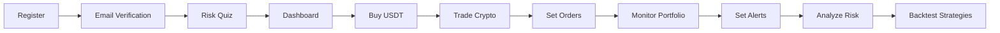

<div align="center">

# 🚀 CoinPrep Simulator

### *Your AI-Powered Crypto Portfolio Manager*

[](https://www.python.org/)
[](https://flask.palletsprojects.com/)
[](https://www.mysql.com/)
[](LICENSE)

[🎯 Features](#-features) • [⚡ Quick Start](#-quick-start) • [📸 Screenshots](#-screenshots) • [🛠️ Tech Stack](#️-tech-stack) • [🎮 Demo](#-demo)


---

### *Track. Analyze. Profit. 📈*

</div>

## 🌟 What is CoinPrep Simulator?

**CoinPrep Simulator** is an intelligent cryptocurrency portfolio management system that combines real-time market data with advanced risk analysis. Built for the modern crypto investor, it provides actionable insights to help you make smarter trading decisions.

> 💡 **Winner Potential**: This project showcases full-stack development, real-time data processing, risk management algorithms, and automated notifications - perfect for hackathon judges!

---

## ✨ Features

<table>
<tr>
<td width="50%">

### 📊 **Smart Portfolio Management**
- Real-time tracking of multiple cryptocurrencies
- Live price updates via CoinGecko API
- Historical performance charts
- Portfolio value visualization
- **Tabbed portfolio view** (Holdings, Trade History, Details)
- **Average buy price calculation** per coin
- **Unrealized P/L tracking** for current holdings
- **Total fees paid** tracking (0.1% per trade)
- Buy/Sell transaction history

</td>
<td width="50%">

### 💱 **Professional Trading Simulator**
- **Multiple order types**: Market, Limit, Stop Loss, Take Profit
- **Trading pairs system**: USDT/CryptoBucks, Crypto/USDT
- **Order management**: View, cancel, and track orders
- **Order book API**: Real-time bid/ask tracking
- **Background order execution**: Auto-executes pending orders
- **Manual order check**: Force check pending orders
- **0.1% trading fees** on all transactions
- Safe learning environment with virtual currency

</td>
</tr>
<tr>
<td width="50%">

### 🎯 **Price Alerts & Notifications**
- Set custom price alerts (above/below)
- Email notifications when targets hit
- In-app notification center
- Alert history tracking
- Multi-coin alert support
- Dismiss and manage alerts easily

</td>
<td width="50%">

### 🧠 **Advanced Risk Analysis**
- **Comprehensive risk assessment quiz** (4 dimensions)
- **AI-powered risk analysis** with personalized insights
- **Diversification recommendations** based on profile
- Volatility metrics (Standard Deviation)
- Portfolio correlation matrix
- Risk-adjusted returns (Sharpe Ratio)
- Asset allocation suggestions

</td>
</tr>
<tr>
<td width="50%">

### 📈 **Backtesting Engine**
- Historical strategy testing
- Performance metrics (ROI, Max Drawdown)
- Risk-reward analysis
- Visual backtest results
- Multiple timeframe support
- Strategy optimization tools

</td>
<td width="50%">

### 🏆 **Gamification & Achievements**
- Track trading milestones
- Unlock achievements
- Progress visualization
- Skill-based rewards
- Competitive leaderboards

</td>
</tr>
<tr>
<td width="50%">

### 🔐 **Secure Authentication**
- Email verification system
- Bcrypt password encryption
- Session management with expiry
- User profile customization
- Secure login/logout
- Password strength indicators

</td>
<td width="50%">

### 🚀 **Performance Optimized**
- API request throttling (5 req/min)
- Response caching (10-min cache)
- Automatic retry with exponential backoff
- Background job scheduling (5-min intervals)
- Efficient database queries
- Connection pooling

</td>
</tr>
</table>

---

## ⚡ Quick Start

### Prerequisites

```bash
✅ Python 3.8+
✅ MySQL 8.0+
✅ Gmail account (for email notifications)
```

### 🎬 Installation

**1️⃣ Clone the Repository**

```bash
git clone https://github.com/Pranavrh53/CoinPrepSimulator.git
cd CoinPrepSimulator
```

**2️⃣ Create Virtual Environment**

```bash
python -m venv venv
venv\Scripts\activate  # Windows
# source venv/bin/activate  # Linux/Mac
```

**3️⃣ Install Dependencies**

```bash
pip install -r requirements.txt
```

**4️⃣ Database Setup**

```bash
# Login to MySQL
mysql -u root -p

# Create and setup database
mysql -u root -p < database.sql

# Setup trading features (orders, trading pairs)
mysql -u root -p crypto_tracker < trading_schema.sql

# (Optional) Initialize with test data
mysql -u root -p crypto_tracker < init_trading.sql
```

Or create manually:
```sql
CREATE DATABASE crypto_tracker;
USE crypto_tracker;
-- Import database.sql first
-- Then import trading_schema.sql
```

> 💡 **Note**: The `trading_schema.sql` adds essential tables for order management, trading pairs, and USDT balance tracking.

**5️⃣ Configure Email (Optional)**

Edit `app.py` and update email settings:

```python
EMAIL_CONFIG = {
    'MAIL_USERNAME': 'your-email@gmail.com',
    'MAIL_PASSWORD': 'your-app-password',  # Use App Password for Gmail
    'MAIL_DEFAULT_SENDER': 'your-email@gmail.com'
}
```

> 💡 **Tip**: Generate a Gmail App Password: [Google Account Settings](https://myaccount.google.com/apppasswords)

**6️⃣ Update Database Credentials**

In `app.py`, modify:

```python
db_config = {
    'host': 'localhost',
    'user': 'root',
    'password': 'YOUR_MYSQL_PASSWORD',
    'database': 'crypto_tracker'
}
```

**7️⃣ Run the Application**

```bash
python app.py
```

🎉 **Open your browser**: http://localhost:5000

---

## 🎮 Demo

### 🎬 User Flow



### 🖥️ Application Flow

1. **Register & Verify**: Create account with email verification
2. **Risk Assessment**: Take comprehensive 4-part risk quiz
3. **Get Started**: Receive 10,000 CryptoBucks (virtual currency)
4. **Buy USDT**: Convert CryptoBucks to USDT (Tether)
5. **Trade Crypto**: Use USDT to trade Bitcoin, Ethereum, and more
6. **Place Orders**: Market, Limit, Stop Loss, or Take Profit
7. **Monitor**: Real-time dashboard with live prices
8. **Set Alerts**: Configure price notifications
9. **Track Performance**: View realized/unrealized profits, fees
10. **Analyze**: View risk metrics, correlations, and recommendations
11. **Backtest**: Test historical trading strategies

---

## 📸 Screenshots

<div align="center">

### 🏠 Dashboard
*Real-time portfolio tracking with live price updates*

```
┌─────────────────────────────────────────────────┐
│  💰 CryptoBucks: $8,500.00                      │
│  💵 USDT Balance: $1,200.00                     │
│  📈 Portfolio Value: $12,543.21                 │
│  📊 Today's Change: +5.43% ($647.23)           │
│                                                 │
│  Bitcoin    ████████████░░░░░  $8,432.10      │
│  Ethereum   ████████░░░░░░░░░  $3,211.11      │
│  Cardano    ███░░░░░░░░░░░░░░  $900.00        │
└─────────────────────────────────────────────────┘
```

### 💱 Trading Interface
*Professional order types with real-time execution*

```
┌─────────────────────────────────────────────────┐
│  Trade BTC/USDT  Current: $43,250.00           │
│                                                 │
│  Order Type:  [Market ▼] [Limit] [Stop Loss]  │
│  Side:        [Buy] [Sell]                     │
│  Amount:      [0.5] BTC                        │
│  Price:       [$42,000] (limit orders)         │
│  Total:       $21,000.00 + $21 fee             │
│                                                 │
│  [Place Order]                                 │
│                                                 │
│  Open Orders:                                   │
│  • Buy 0.5 BTC @ $41,000 (Limit)              │
│  • Sell 1.0 ETH @ $3,500 (Take Profit)        │
└─────────────────────────────────────────────────┘
```

### 📊 Portfolio Summary
*Comprehensive profit/loss tracking*

```
┌─────────────────────────────────────────────────┐
│  📈 Realized P/L:    +$1,245.00                │
│  📉 Unrealized P/L:  +$543.21                  │
│  💸 Total Fees:      -$45.67                   │
│                                                 │
│  Holdings (Avg Price):                          │
│  BTC  0.5 @ $41,500  Current: $43,250  +4.2%  │
│  ETH  2.0 @ $3,100   Current: $3,250   +4.8%  │
│                                                 │
│  Trade History:                                 │
│  ✅ SELL 0.3 BTC @ $44,000 (+$750, -$13 fee)  │
│  ✅ BUY  1.0 ETH @ $3,100 (-$3,100, -$3 fee)  │
└─────────────────────────────────────────────────┘
```

### 🎯 Price Alerts
*Get notified when your targets are hit*

```
┌─────────────────────────────────────────────────┐
│  🔔 Alert: Bitcoin reached $45,000!            │
│  🔔 Alert: Ethereum above $3,000!              │
│                                                 │
│  Set New Alert:                                 │
│  Coin: [Dogecoin ▼]  Price: [$0.15]           │
│  Type: [Above ▼]     [Set Alert]              │
└─────────────────────────────────────────────────┘
```

### 🧠 Risk Assessment
*Comprehensive 4-part quiz with AI analysis*

```
┌─────────────────────────────────────────────────┐
│  Risk Profile: Moderate Investor                │
│  Overall Score: 58%                             │
│                                                 │
│  Dimensions:                                    │
│  • Financial Capacity:    65% ████████░░       │
│  • Investment Knowledge:  70% █████████░       │
│  • Psychological:         45% █████░░░░░       │
│  • Goals & Timeline:      52% ██████░░░░       │
│                                                 │
│  Recommended Allocation:                        │
│  • Stocks: 50-60%                              │
│  • Bonds: 30-40%                               │
│  • Crypto: 5-10% (established coins only)      │
│                                                 │
│  AI Insights:                                   │
│  ✓ Strong financial capacity                   │
│  ⚠ Low psychological tolerance                 │
│  → Focus on stable investments                 │
│  → Use stop-loss protection                    │
└─────────────────────────────────────────────────┘
```

</div>

---

## 🛠️ Tech Stack

<div align="center">

| Layer | Technologies |
|-------|-------------|
| **Backend** |   |
| **Database** |  |
| **Frontend** |    |
| **API** |  |
| **Charts** |  |
| **Security** |  |
| **Scheduler** |  |

</div>

### 🔧 Key Libraries

```python
# Core Framework
Flask==2.3.2              # Web framework
flask-bcrypt==1.0.1       # Password hashing
mysql-connector==8.0.33   # Database connector

# Data & Analysis
numpy==1.24.3             # Numerical computing
pandas==2.0.2             # Data analysis

# External APIs
requests==2.31.0          # API calls (CoinGecko)

# Background Jobs
apscheduler==3.10.1       # Scheduled tasks (price checks, order execution)

# Email Notifications
smtplib                   # Email sending (built-in)

# Utilities
python-dotenv             # Environment variables
```

---

## 🏗️ Architecture

```
┌─────────────────────────────────────────────────────┐
│                   Frontend Layer                     │
│  (HTML/CSS/JS + Chart.js + Bootstrap 5)             │
└──────────────────┬──────────────────────────────────┘
                   │
┌──────────────────▼──────────────────────────────────┐
│                  Flask Backend                       │
│  ┌──────────────────────────────────────────────┐  │
│  │  Routes & Controllers                        │  │
│  ├──────────────────────────────────────────────┤  │
│  │  • Authentication & Session Management       │  │
│  │  • Portfolio Management                      │  │
│  │  • Trading Engine (4 order types)            │  │
│  │  • Order Execution Engine                    │  │
│  │  • Alert System & Notifications              │  │
│  │  • Risk Analysis Engine (AI-powered)         │  │
│  │  • Backtesting Engine                        │  │
│  │  • Achievement System                        │  │
│  └──────────────────────────────────────────────┘  │
│                                                      │
│  ┌──────────────────────────────────────────────┐  │
│  │  Background Scheduler (APScheduler)          │  │
│  ├──────────────────────────────────────────────┤  │
│  │  • Price Alert Checker (5 min intervals)     │  │
│  │  • Pending Order Executor (5 min intervals)  │  │
│  └──────────────────────────────────────────────┘  │
└───────────┬────────────────────────┬────────────────┘
            │                        │
┌───────────▼──────────┐  ┌─────────▼─────────────────┐
│   MySQL Database     │  │  CoinGecko API            │
│  • Users             │  │  • Live Prices            │
│  • Wallets           │  │  • Historical Data        │
│  • Transactions      │  │  • Market Data            │
│  • Orders            │  │  • 24h High/Low           │
│  • Order Fills       │  │  • Trading Volume         │
│  • Trading Pairs     │  │  • Coin Info              │
│  • Price Alerts      │  │  • Market Charts          │
│  • Notifications     │  │                           │
│  • Risk Assessments  │  │  Cache Layer (10 min)     │
│  • Achievements      │  │  Rate Limiter (5/min)     │
└──────────────────────┘  └───────────────────────────┘
```

---

## 📚 API Endpoints

<details>
<summary><b>🔐 Authentication</b></summary>

| Method | Endpoint | Description |
|--------|----------|-------------|
| `GET/POST` | `/register` | User registration |
| `GET/POST` | `/login` | User login |
| `GET/POST` | `/verify/<email>` | Email verification |
| `GET` | `/logout` | User logout |

</details>

<details>
<summary><b>� Trading & Orders</b></summary>

| Method | Endpoint | Description |
|--------|----------|-------------|
| `POST` | `/trade` | Place order (Market, Limit, Stop Loss, Take Profit) |
| `GET` | `/orders` | View all orders (open/filled/cancelled) |
| `POST` | `/cancel_order/<id>` | Cancel pending order |
| `GET` | `/check_orders_now` | Manually trigger order execution check |
| `GET` | `/trading_pairs` | Get available trading pairs |
| `GET` | `/api/orderbook/<pair>` | Get order book for trading pair |

</details>

<details>
<summary><b>📊 Portfolio Management</b></summary>

| Method | Endpoint | Description |
|--------|----------|-------------|
| `GET` | `/dashboard` | Main dashboard with balances |
| `GET/POST` | `/portfolio` | Portfolio with holdings, history, and details |
| `GET` | `/live_market` | Live market data with trading interface |
| `GET` | `/watchlist` | Manage watchlist |
| `GET` | `/historical/<coin_id>` | Historical price charts |
| `GET` | `/correlation_matrix` | Portfolio correlation analysis |

</details>

<details>
<summary><b>🔔 Alerts & Notifications</b></summary>

| Method | Endpoint | Description |
|--------|----------|-------------|
| `GET/POST` | `/alerts` | Create and manage price alerts |
| `POST` | `/remove_alert/<id>` | Remove price alert |
| `POST` | `/dismiss_alert/<id>` | Dismiss notification |
| `POST` | `/refresh_alerts` | Refresh alert status |
| `POST` | `/trade_from_alert` | Quick trade from alert notification |

</details>

<details>
<summary><b>📈 Analytics & Risk</b></summary>

| Method | Endpoint | Description |
|--------|----------|-------------|
| `GET/POST` | `/risk_quiz` | Comprehensive risk assessment quiz |
| `GET` | `/backtester` | Backtesting interface |
| `POST` | `/api/backtest` | Run backtest simulation |
| `GET` | `/achievements` | View achievements and progress |
| `POST` | `/update_achievements` | Update achievement status |

</details>

<details>
<summary><b>🛠️ Utility</b></summary>

| Method | Endpoint | Description |
|--------|----------|-------------|
| `GET` | `/test-email` | Test email notification system |

</details>

---

## 🎯 Key Features Explained

### 💱 Professional Trading System

The app now includes a complete trading simulator with professional features:

**Currency Flow:**
1. Users start with **10,000 CryptoBucks** (virtual currency)
2. Convert CryptoBucks → **USDT** (Tether stablecoin)
3. Use USDT to trade **9 major cryptocurrencies**

**Order Types:**
- **Market Order**: Instant execution at current price
- **Limit Order**: Execute when price reaches target
- **Stop Loss**: Auto-sell to prevent losses
- **Take Profit**: Auto-sell to lock in gains

**Trading Fees:**
- 0.1% fee on every transaction
- Tracked in portfolio summary

```python
def execute_order(cursor, conn, order, execution_price):
    # Validates balance
    # Calculates fees (0.1%)
    # Updates user balance
    # Records transaction
    # Marks order as filled
```

### 📊 Enhanced Portfolio Tracking

**Three-Tab Portfolio View:**
1. **Holdings**: Grouped by coin, shows average buy price and unrealized P/L
2. **Trade History**: All buy/sell transactions with fees and profit calculations
3. **Transaction Details**: Individual transaction entries with sell options

**Key Metrics:**
- **Realized P/L**: Profits/losses from completed sells
- **Unrealized P/L**: Current value vs. purchase cost
- **Total Fees Paid**: Sum of all trading fees

```python
# Calculate average buy price per coin
for coin_id, holding in grouped_holdings.items():
    holding['avg_buy_price'] = holding['total_cost'] / holding['total_amount']
    current_value = holding['total_amount'] * current_price
    holding['unrealized_profit'] = current_value - holding['total_cost']
```

### 🤖 Intelligent Risk Analysis

**Comprehensive 4-Part Assessment:**
1. **Financial Capacity** (30%): Income, savings, emergency funds
2. **Investment Knowledge** (25%): Experience and education
3. **Psychological Tolerance** (25%): Emotional response to volatility
4. **Goals & Timeline** (20%): Investment horizon and objectives

**AI-Powered Analysis Includes:**
- Risk profile classification (Conservative to Aggressive)
- Strengths and concerns identification
- Personalized recommendations
- Asset allocation suggestions (stocks, bonds, crypto)
- Crypto-specific advice based on risk level
- Action steps and risk management strategies

```python
def generate_ai_analysis(scores, user_data):
    # Calculates weighted risk score
    # Identifies dimension mismatches
    # Generates personalized recommendations
    # Suggests asset allocation
    # Provides crypto-specific guidance
```

### 🔄 Automated Order Execution

Background scheduler runs every 5 minutes to:
- Check pending limit orders
- Evaluate stop loss triggers
- Monitor take profit targets
- Execute orders when conditions met
- Send notifications on fills

```python
def check_pending_orders():
    # Fetches all pending orders
    # Gets current prices from API
    # Evaluates execution conditions
    # Calls execute_order() when triggered
    # Commits each successful execution
```

### 📧 Smart Notification System

- Background scheduler checks prices every 5 minutes
- Triggers alerts based on user preferences
- Sends email notifications automatically
- Prevents duplicate alerts
- Provides in-app notification center

```python
def check_price_alerts():
    # Query active alerts
    # Fetch current prices
    # Compare with thresholds
    # Send email notifications
    # Mark alerts as notified
```

### 🔄 API Optimization

- **Caching**: 10-minute cache for API responses
- **Throttling**: 5 requests per minute limit
- **Retry Logic**: Exponential backoff on failures (3 retries, 10s base delay)
- **Fallback**: Uses cached data if API fails

---

## 📁 Project Structure

```
CoinPrepSimulator/
├── app.py                          # Main Flask application
├── requirements.txt                # Python dependencies
├── database.sql                    # Main database schema
├── trading_schema.sql              # Trading features schema
├── init_trading.sql                # Test data initialization
├── risk_assessment_data.py         # Risk quiz questions & logic
├── risk_assessment_routes.py       # Risk assessment endpoints
├── risk_assessment_schema.sql      # Risk assessment tables
├── update_db_schema.py            # Schema migration script
├── update_risk_columns.sql        # Risk column updates
├── test_alert.py                  # Alert system tests
├── README.md                       # This file
├── IMPLEMENTATION_SUMMARY.md       # Trading features summary
├── TRADING_FEATURES.md            # Trading documentation
├── QUICK_START.md                 # Quick setup guide
├── UI_TEMPLATES.md                # Frontend templates guide
├── templates/
│   ├── combined.html              # Main UI template
│   └── backtester.html            # Backtesting interface
├── static/
│   ├── css/
│   │   └── style.css              # Custom styles
│   └── js/
│       ├── script.js              # Main JavaScript
│       └── charts.js              # Chart configurations
└── __pycache__/                   # Python cache files
```

## 🎓 What I Learned

<div align="center">

```ascii
┌──────────────────────────────────────────┐
│  ✅ Real-time data processing            │
│  ✅ RESTful API integration              │
│  ✅ Advanced SQL queries & optimization  │
│  ✅ Email automation with SMTP           │
│  ✅ Background job scheduling            │
│  ✅ Financial trading algorithms         │
│  ✅ Order matching & execution           │
│  ✅ Risk assessment & AI analysis        │
│  ✅ Financial data analysis              │
│  ✅ Transaction fee calculations         │
│  ✅ Session-based authentication         │
│  ✅ Rate limiting & caching              │
│  ✅ Frontend-backend integration         │
│  ✅ Bootstrap 5 & responsive design      │
│  ✅ Complex database relationships       │
└──────────────────────────────────────────┘
```

</div>

---

## 🚀 Future Enhancements

- [ ] 🌐 Multi-currency support (EUR, GBP, INR)
- [ ] 📱 Mobile app (React Native)
- [ ] 🤖 AI-powered price predictions using ML
- [ ] 💱 DEX integration for live blockchain trading
- [ ] 📊 Advanced charting (candlesticks, technical indicators)
- [ ] 🔗 Blockchain wallet integration (MetaMask, WalletConnect)
- [ ] 👥 Social features (share portfolios, copy trading)
- [ ] 📰 News sentiment analysis integration
- [ ] 🎨 Dark mode theme toggle
- [ ] 🌍 Multi-language support (i18n)
- [ ] 📈 Portfolio rebalancing recommendations
- [ ] 🔔 Push notifications for mobile
- [ ] 📊 Tax reporting & export features
- [ ] 🎮 Advanced gamification with badges
- [ ] 🤝 Referral system & rewards

---

## 🐛 Known Issues & Fixes

| Issue | Solution |
|-------|----------|
| API rate limiting | Implement caching (✅ Done) |
| Email not sending | Use Gmail App Password |
| Database connection timeout | Increase connection pool size |
| Slow dashboard load | Optimize queries with indexing |

---

## 🤝 Contributing

Contributions are welcome! Here's how:

1. **Fork** the repository
2. **Create** a feature branch (`git checkout -b feature/AmazingFeature`)
3. **Commit** your changes (`git commit -m 'Add AmazingFeature'`)
4. **Push** to the branch (`git push origin feature/AmazingFeature`)
5. **Open** a Pull Request

---

## 📄 Database Schema

<details>
<summary><b>View Complete Schema</b></summary>

```sql
-- Users table
CREATE TABLE users (
    id INT PRIMARY KEY AUTO_INCREMENT,
    username VARCHAR(50) UNIQUE NOT NULL,
    email VARCHAR(100) UNIQUE NOT NULL,
    password VARCHAR(255) NOT NULL,
    crypto_bucks DECIMAL(20, 2) DEFAULT 10000.00,
    tether_balance DECIMAL(20, 8) DEFAULT 0.00,
    verified BOOLEAN DEFAULT FALSE,
    verification_code VARCHAR(6),
    created_at TIMESTAMP DEFAULT CURRENT_TIMESTAMP
);

-- Wallets table
CREATE TABLE wallets (
    id INT PRIMARY KEY AUTO_INCREMENT,
    user_id INT NOT NULL,
    name VARCHAR(100) NOT NULL,
    created_at TIMESTAMP DEFAULT CURRENT_TIMESTAMP,
    FOREIGN KEY (user_id) REFERENCES users(id) ON DELETE CASCADE
);

-- Transactions table (portfolio entries)
CREATE TABLE transactions (
    id INT PRIMARY KEY AUTO_INCREMENT,
    user_id INT NOT NULL,
    wallet_id INT NOT NULL,
    coin_id VARCHAR(50) NOT NULL,
    amount DECIMAL(20, 8) NOT NULL,
    price DECIMAL(20, 8) NOT NULL,
    type ENUM('buy', 'sell') NOT NULL,
    sold_price DECIMAL(20, 8) DEFAULT NULL,
    buy_transaction_id INT DEFAULT NULL,
    created_at TIMESTAMP DEFAULT CURRENT_TIMESTAMP,
    FOREIGN KEY (user_id) REFERENCES users(id) ON DELETE CASCADE,
    FOREIGN KEY (wallet_id) REFERENCES wallets(id) ON DELETE CASCADE,
    FOREIGN KEY (buy_transaction_id) REFERENCES transactions(id)
);

-- Trading pairs table
CREATE TABLE trading_pairs (
    id INT PRIMARY KEY AUTO_INCREMENT,
    base_currency VARCHAR(50) NOT NULL,
    quote_currency VARCHAR(50) NOT NULL,
    is_active BOOLEAN DEFAULT TRUE,
    created_at TIMESTAMP DEFAULT CURRENT_TIMESTAMP,
    UNIQUE KEY unique_pair (base_currency, quote_currency)
);

-- Orders table (limit, stop loss, take profit)
CREATE TABLE orders (
    id INT PRIMARY KEY AUTO_INCREMENT,
    user_id INT NOT NULL,
    wallet_id INT NOT NULL,
    base_currency VARCHAR(50) NOT NULL,
    quote_currency VARCHAR(50) NOT NULL,
    order_type ENUM('market', 'limit', 'stop_loss', 'take_profit') NOT NULL,
    side ENUM('buy', 'sell') NOT NULL,
    amount DECIMAL(20, 8) NOT NULL,
    price DECIMAL(20, 8) DEFAULT NULL,
    stop_price DECIMAL(20, 8) DEFAULT NULL,
    status ENUM('pending', 'filled', 'cancelled') DEFAULT 'pending',
    filled_amount DECIMAL(20, 8) DEFAULT 0.00,
    created_at TIMESTAMP DEFAULT CURRENT_TIMESTAMP,
    filled_at TIMESTAMP NULL,
    cancelled_at TIMESTAMP NULL,
    FOREIGN KEY (user_id) REFERENCES users(id) ON DELETE CASCADE,
    FOREIGN KEY (wallet_id) REFERENCES wallets(id) ON DELETE CASCADE
);

-- Order fills table (execution history)
CREATE TABLE order_fills (
    id INT PRIMARY KEY AUTO_INCREMENT,
    order_id INT NOT NULL,
    user_id INT NOT NULL,
    filled_amount DECIMAL(20, 8) NOT NULL,
    filled_price DECIMAL(20, 8) NOT NULL,
    filled_at TIMESTAMP DEFAULT CURRENT_TIMESTAMP,
    FOREIGN KEY (order_id) REFERENCES orders(id) ON DELETE CASCADE,
    FOREIGN KEY (user_id) REFERENCES users(id) ON DELETE CASCADE
);

-- Price alerts table
CREATE TABLE price_alerts (
    id INT PRIMARY KEY AUTO_INCREMENT,
    user_id INT NOT NULL,
    coin_id VARCHAR(50) NOT NULL,
    target_price DECIMAL(20, 8) NOT NULL,
    alert_type ENUM('above', 'below') NOT NULL,
    notified BOOLEAN DEFAULT FALSE,
    created_at TIMESTAMP DEFAULT CURRENT_TIMESTAMP,
    FOREIGN KEY (user_id) REFERENCES users(id) ON DELETE CASCADE
);

-- Notifications table
CREATE TABLE notifications (
    id INT PRIMARY KEY AUTO_INCREMENT,
    user_id INT NOT NULL,
    coin_id VARCHAR(50) NOT NULL,
    message TEXT NOT NULL,
    is_read BOOLEAN DEFAULT FALSE,
    created_at TIMESTAMP DEFAULT CURRENT_TIMESTAMP,
    FOREIGN KEY (user_id) REFERENCES users(id) ON DELETE CASCADE
);

-- Risk assessments table
CREATE TABLE risk_assessments (
    id INT PRIMARY KEY AUTO_INCREMENT,
    user_id INT NOT NULL,
    financial_score DECIMAL(5, 2),
    knowledge_score DECIMAL(5, 2),
    psychological_score DECIMAL(5, 2),
    goals_score DECIMAL(5, 2),
    total_score DECIMAL(5, 2),
    risk_level VARCHAR(50),
    assessment_data JSON,
    created_at TIMESTAMP DEFAULT CURRENT_TIMESTAMP,
    FOREIGN KEY (user_id) REFERENCES users(id) ON DELETE CASCADE
);

-- Achievements table
CREATE TABLE achievements (
    id INT PRIMARY KEY AUTO_INCREMENT,
    user_id INT NOT NULL,
    achievement_type VARCHAR(100) NOT NULL,
    progress INT DEFAULT 0,
    unlocked BOOLEAN DEFAULT FALSE,
    unlocked_at TIMESTAMP NULL,
    FOREIGN KEY (user_id) REFERENCES users(id) ON DELETE CASCADE
);

-- Watchlist table
CREATE TABLE watchlist (
    id INT PRIMARY KEY AUTO_INCREMENT,
    user_id INT NOT NULL,
    coin_id VARCHAR(50) NOT NULL,
    added_at TIMESTAMP DEFAULT CURRENT_TIMESTAMP,
    FOREIGN KEY (user_id) REFERENCES users(id) ON DELETE CASCADE,
    UNIQUE KEY unique_watchlist (user_id, coin_id)
);
```

</details>

---

## 🎪 Hackathon Highlights

### 🏆 Why This Project Stands Out

1. **🎯 Real-World Application**: Complete trading simulator that teaches investment concepts
2. **💡 Innovation**: Combines portfolio tracking, risk analysis, and trading education
3. **🔧 Technical Complexity**: 
   - Full-stack architecture
   - 4 order types with automated execution
   - Background job scheduling
   - Real-time data processing
   - Advanced financial calculations
4. **🎨 Professional UX/UI**: 
   - Clean Bootstrap 5 design
   - Glassmorphism effects
   - Responsive layouts
   - Intuitive workflows
5. **📈 Scalability**: Modular architecture ready for expansion
6. **🔐 Production-Ready Security**: 
   - Bcrypt encryption
   - Email verification
   - Session management
   - SQL injection prevention
7. **📧 Automation**: 
   - Background price monitoring
   - Order execution engine
   - Email notifications
8. **🧠 AI-Powered**: Personalized risk analysis with comprehensive recommendations

### 🎓 Skills Demonstrated

- **Backend**: Flask, Python, RESTful APIs, background tasks
- **Database**: MySQL, complex relationships, transactions, optimization
- **Frontend**: HTML5, CSS3, JavaScript, Bootstrap 5, Chart.js
- **Finance**: Trading algorithms, order matching, P/L calculations, risk assessment
- **DevOps**: API caching, rate limiting, error handling, retry logic
- **Security**: Authentication, password hashing, session management
- **Integration**: Third-party API integration (CoinGecko)
- **Automation**: Email notifications, scheduled jobs, order execution

### 📊 Project Statistics

- **Lines of Code**: ~2,500+ Python, ~1,000+ HTML/CSS/JS
- **Database Tables**: 11 tables with complex relationships
- **API Endpoints**: 30+ routes handling various operations
- **Order Types**: 4 (Market, Limit, Stop Loss, Take Profit)
- **Background Jobs**: 2 (price alerts, order execution)
- **Risk Dimensions**: 4 (Financial, Knowledge, Psychological, Goals)
- **Supported Coins**: 9 major cryptocurrencies + USDT

---

## 📞 Contact & Support

<div align="center">

**Created by Pranav RH**

[](https://github.com/Pranavrh53)
[](mailto:frozenflames677@gmail.com)

### ⭐ Star this repo if you find it helpful!

</div>

---

## 📜 License

This project is licensed under the MIT License - see the [LICENSE](LICENSE) file for details.

---

<div align="center">

### 💰 *Made with ❤️ for Crypto Enthusiasts*

```
  ▄████████     ▄████████ ▄██   ▄      ▄███████▄  ███      ▄██████▄  
  ███    ███   ███    ███ ███   ██▄   ███    ███ ▀█████████▄ ███    ███ 
  ███    █▀    ███    ███ ███▄▄▄███   ███    ███    ▀███▀▀██ ███    ███ 
  ███         ▄███▄▄▄▄██▀ ▀▀▀▀▀▀███   ███    ███     ███   ▀ ███    ███ 
  ███        ▀▀███▀▀▀▀▀   ▄██   ███ ▀█████████▀      ███     ███    ███ 
  ███    █▄  ▀███████████ ███   ███   ███            ███     ███    ███ 
  ███    ███   ███    ███ ███   ███   ███            ███     ███    ███ 
  ████████▀    ███    ███  ▀█████▀   ▄████▀         ▄████▀    ▀██████▀  
```

**[⬆ Back to Top](#-coinprep-simulator)**

</div>
